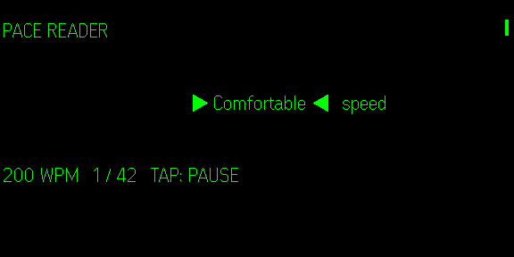

# Pace Reader

Pace Reader is a context-preserving EPUB reader for Even G2. Import books from Files, keep a private on-device library, and continue each title from its own saved word and reading speed. Pasted text remains available for quick reads.

The middle word is the focus. The previous and next words stay visible for context. Sentence punctuation, clause punctuation, and long words receive extra dwell time. Tap to pause, scroll to adjust speed, rewind a sentence from the menu, or restart the reading.



## Why this design

Pace Reader does not promise superhuman reading or perfect comprehension. Research on rapid serial visual presentation is mixed, and readers lose normal eye movements such as looking back at difficult text. This app caps the selected base pace, preserves nearby context, and makes pause and rewind easy.

## Safety

Use Pace Reader only while stationary. Do not use it while walking, cycling, driving, or operating machinery. Stop if you feel eye strain, headache, nausea, dizziness, disorientation, or reduced awareness of your surroundings.

## Privacy

Pace Reader stores imported book text and per-book reading progress locally on the phone. It has no account, analytics, advertising, or app-controlled network service. It requests no network, microphone, camera, location, or album permission. See [PRIVACY.md](PRIVACY.md).

## EPUB library

- Import local EPUB 2 and EPUB 3 files from the phone's file picker.
- Read chapters in the book's declared spine order.
- Preserve title, author, current word, completion state, and WPM per book.
- Continue the most recently read book from the library home screen.
- Delete a book and its saved place from the device at any time.

EPUB parsing happens entirely in the plugin. Imported files and extracted text are never uploaded.

## Controls

| Input | Action |
|---|---|
| Tap | Pause or resume |
| Scroll up | Increase speed by 25 WPM |
| Scroll down | Decrease speed by 25 WPM |
| Menu: Rewind sentence | Return to the start of the current sentence |
| Menu: Restart reading | Return to the first word |
| Double tap | Open the system exit flow |

## Development

Requires Node.js 20 or newer.

```bash
npm ci
npm run dev
```

In another terminal:

```bash
npm run simulate
```

Run the full local gate:

```bash
npm run check
npm run pack
```

The pack script builds the app and creates `pace-reader.ehpk` with Even Hub SDK `0.0.14` metadata. Package ID availability is checked separately before the first catalog upload:

```bash
npx evenhub pack app.json dist -o pace-reader.ehpk --sdk-ver 0.0.14 --check
```

## Architecture

| File | Purpose |
|---|---|
| `src/reader.ts` | Pure reader state machine, timing, speed bounds, pause, rewind, restart, and resume state |
| `src/display.ts` | Pixel-aware three-word G2 frame formatting |
| `src/events.ts` | G2 gesture and lifecycle event mapping |
| `src/main.ts` | Even Hub bridge, serialized display writes, persistence, and lifecycle handling |
| `src/companion.ts` | Even-style phone library, EPUB import, quick read, and live mirror |
| `src/epub.ts` | Local EPUB 2/3 metadata, spine, chapter, and text extraction |
| `src/library.ts` | IndexedDB book library and per-book progress persistence |
| `app.json` | Even Hub manifest with no special permissions |

The display uses one `textContainerUpgrade` for each accepted word advance. Writes are serialized, the next timer starts only after the prior display update finishes, and slow bridge responses reduce the reading speed instead of skipping words.

## Release status

Version `0.2.0` is prepared as `com.jcpsimmons.pacereader`. Automated tests and the EvenHub desktop simulator pass, including EPUB parsing, per-book resume state, moving text, pause/resume, speed adjustment, and the root shutdown request. Real G2 testing, including EPUB import from iOS, phone-lock, and background behavior, remains required before catalog submission.

See [docs/submission.md](docs/submission.md) for the release checklist and [store/listing.md](store/listing.md) for catalog copy.

## License

MIT. See [LICENSE](LICENSE). The project began from the Even Realities `text-heavy` EvenHub template; its original MIT notice is preserved.
